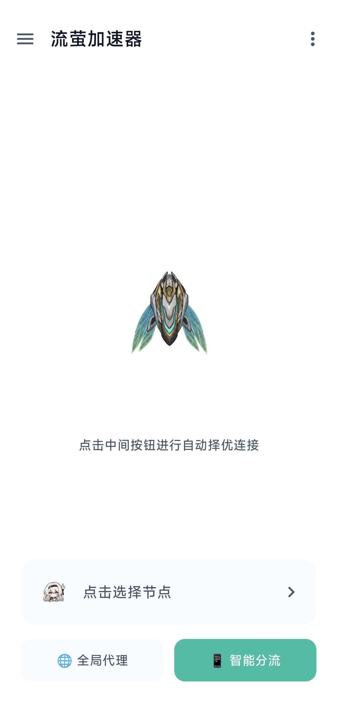
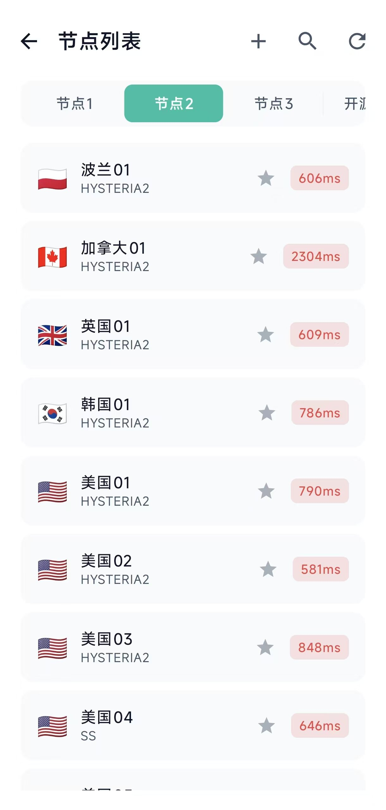
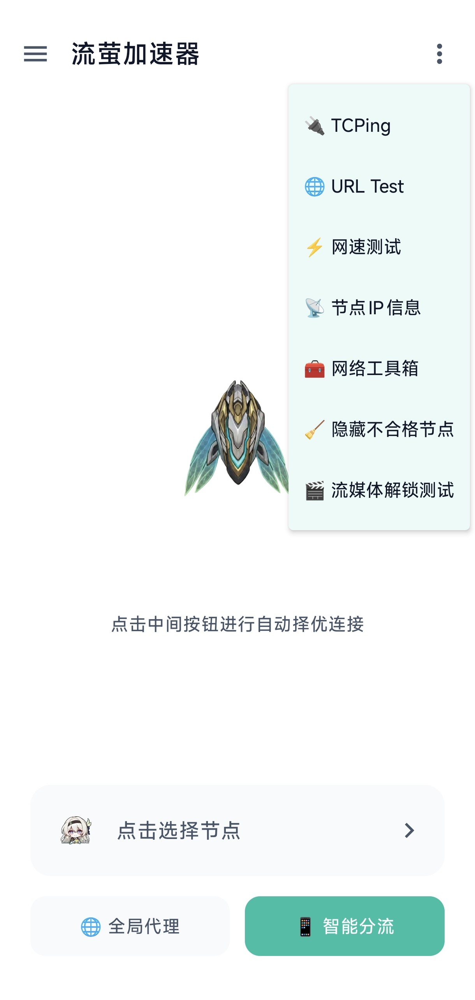
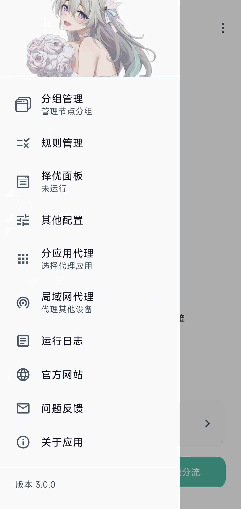

# 流萤加速器（FireflyVPN）

  

  基于 sing-box 的 Android VPN 客户端，专注于节点管理、智能分流、网络测试与稳定连接。

  
  
  
  
  

  <a href="#preview">界面预览</a> ·
  <a href="#features">主要功能</a> ·
  <a href="#quick-start">快速开始</a> ·
  <a href="#client-config">客户端配置</a> ·
  <a href="#backend">后端与 Crypto V2</a> ·
  <a href="#security">安全与隐私</a> ·
  <a href="#structure">项目结构</a> ·
  <a href="#docs">相关文档</a>

> [!IMPORTANT]
> 本项目为非营利开源作品，与米哈游（HoYoverse）无关。使用项目时请遵守所在地法律法规。

## 🖼️ 界面预览

  
  
  
  

## ✨ 主要功能

- 支持 VLESS、VMess、Trojan、Hysteria2、AnyTLS、TUIC、Naive、WireGuard、Shadowsocks、SOCKS4/5 与 HTTP(S)。
- 支持全局代理和智能分流，并提供中国域名/IP、广告拦截及 QUIC 规则管理。
- 提供订阅分组、内置线路、收藏、剪贴板导入、二维码导入、去重和核心配置校验。
- 支持 TCPing、URL Test、上下行测速、流媒体解锁检测、出口 IP 查询和自动择优。
- 支持分应用代理、IPv6、局域网绕过、局域网 HTTP/SOCKS5 代理及多种 TUN 实现。
- VPN 出口异常时可自动复核、刷新节点并按地址与名称匹配原节点重连。
- Hysteria2 上下行带宽可手动设置，也可通过直连测速生成自适应建议。
- 提供运行日志、远程公告、应用内更新、深色模式和 VPN 实时流量通知。

## 🧰 技术栈

| 模块 | 实现 |
| --- | --- |
| 客户端 | Kotlin、Jetpack Compose、MVVM、Coroutines |
| VPN 核心 | sing-box / libbox |
| 网络 | OkHttp、Retrofit、Gson |
| 数据 | Room + SQLCipher、DataStore |
| 扫码 | CameraX、ML Kit |
| 后端 | Cloudflare Workers、TypeScript、Hono、D1、KV |
| 安全下发 | P-256 ECDH、HKDF-SHA256、AES-256-GCM |

当前构建目标为 Android 7.0（API 24）及以上，compile/target SDK 为 35，仅输出 arm64-v8a 和 armeabi-v7a。

## 🚀 快速开始

### 环境

- Android Studio 2024.1.1 或更新版本
- JDK 17
- Android SDK 35
- NDK 25.1.8937393
- CMake 3.22.1
- libbox.aar

### 构建

~~~bash
git clone https://github.com/Iskongkongyo/FireflyVPN.git
cd FireflyVPN
~~~

将与你的 sing-box 版本及目标 ABI 匹配的 libbox.aar 放入：

~~~text
app/libs/libbox.aar
~~~

项目的 Debug 与 Release 构建均使用 Release 签名。请在根目录准备签名文件，并创建未提交到版本库的 keystore.properties：

~~~properties
storeFile=your-release-key.jks
storePassword=your-store-password
keyAlias=your-key-alias
keyPassword=your-key-password
~~~

Native 层还会验证 APK 证书。更换签名时，需同步更新 app/src/main/cpp/native-lib.cpp 中的目标证书 SHA-256。

~~~bash
# Linux / macOS
./gradlew assembleDebug

# Windows
.\gradlew.bat assembleDebug
~~~

APK 输出位于 app/build/outputs/apk/。发布版本使用：

~~~bash
./gradlew assembleRelease
~~~

## ⚙️ 客户端配置

常用修改入口：

| 内容 | 文件 |
| --- | --- |
| Worker 域名、启动画面、网络测试地址 | app/src/main/java/xyz/a202132/app/AppConfig.kt |
| APP 包名、版本号、目标 SDK、ABI | app/build.gradle.kts |
| 主题颜色与排版 | app/src/main/java/xyz/a202132/app/ui/theme/ |
| 规则定义与下载源 | app/src/main/java/xyz/a202132/app/rules/data/RuleRegistry.kt |
| 用户设置与默认值 | app/src/main/java/xyz/a202132/app/data/repository/SettingsRepository.kt |

更换自建后端时，只需修改 AppConfig.API_BASE_URL；bootstrap、订阅目录和用量上报路径会由它统一派生。

## 🔐 后端与 Crypto V2

后端位于 [backend](./backend/)，客户端使用纯匿名设备身份，不提供邮箱或密码登录。

核心流程：

1. 从 GET /api/v2/bootstrap 获取公告、更新、公开设置及加密协议版本。
2. 首次安装生成设备 ID 与 P-256 密钥对，并通过 POST /api/v2/devices/enroll 注册。
3. 携带 Device Token 获取 /api/v2/subscriptions 安全目录。
4. 使用一次性 Challenge 获取 Crypto V2 加密正文，在本机完成解密与完整性校验。
5. VPN 会话结束后幂等上报流量；失败报告保留在本地，后续自动重试。

客户端只接受 P256-HKDF-SHA256-A256GCM，不会降级到旧版订阅加密。设备凭据和安全订阅请求均限制在配置的 Worker 同源地址。

后端开发、部署和完整接口说明：

- [后端部署说明](./backend/README.md)
- [API 契约](./backend/API.md)

## 🛡️ 安全与隐私

- 设备私钥由 Android Keystore 保护，服务端只保存设备公钥和 Token 哈希。
- 本地节点数据库使用 SQLCipher 加密。
- 订阅正文采用每设备 Crypto V2 加密，并校验 Challenge、AAD、订阅 ID 和有效期。
- 规则更新先校验再原子替换，失败时保留当前可用版本。
- VPN 启动及节点导入前通过 sing-box 检查配置。
- 应用日志会脱敏，不记录完整节点链接、密码、Token、密钥或生成后的 sing-box 配置。
- StringFog、Native 签名校验和代码压缩只能提高篡改成本，不能代替服务端鉴权。

请勿提交签名文件、keystore.properties、Cloudflare Secret、.dev.vars 或其他生产凭据。

## 🗂️ 项目结构

~~~text
├── app/                         Android 客户端
│   └── src/main/
│       ├── java/.../app/
│       │   ├── data/            数据模型、数据库与设置
│       │   ├── network/         API、订阅、测速与诊断
│       │   ├── rules/           规则管理
│       │   ├── service/         VPN 与 libbox 生命周期
│       │   ├── ui/              Compose 页面与组件
│       │   └── util/            配置生成、加密及通用工具
│       ├── assets/rule-sets/    内置 SRS 规则
│       ├── cpp/                 Native 签名校验
│       └── jniLibs/             UnlockTests 原生库
├── backend/                     Cloudflare Workers 后端（含 D1 迁移）
├── protocol/crypto-v2/          协议说明与跨平台测试向量
└── images/                      README 图片
~~~

## 🧪 测试

~~~bash
# Android 单元测试与构建
./gradlew testDebugUnitTest
./gradlew assembleDebug

# 后端
cd backend
npm install
npm run typecheck
npm test
~~~

涉及 VPN、TUN、Android Keystore、二维码或 Native 库的功能，还应在真机上验证。

## 📚 相关文档

| 文档 | 用途 |
| --- | --- |
| [backend/API.md](./backend/API.md) | 当前 /api/v2 接口契约 |
| [backend/README.md](./backend/README.md) | 后端开发、D1/KV 初始化与部署 |

## 📜 开源协议

本项目基于 [GNU General Public License v3.0](./LICENSE) 开源。第三方组件遵循各自许可证：

- [SagerNet/sing-box](https://github.com/SagerNet/sing-box)
- [UnlockTests](https://github.com/oneclickvirt/UnlockTests)
- [Jetpack Compose](https://developer.android.com/jetpack/compose)

## 💖 致谢

感谢以下开源项目与社区为 FireflyVPN 提供的重要基础与灵感：

- [sing-box](https://github.com/SagerNet/sing-box) —— 提供强大、现代的代理核心能力。
- [UnlockTests](https://github.com/oneclickvirt/UnlockTests) —— 提供流媒体与网络解锁检测能力。
- [Jetpack Compose](https://developer.android.com/jetpack/compose) 与 Android / Kotlin 开源生态 —— 为客户端界面与开发体验提供支持。
- 感谢所有提交 Issue、反馈建议、参与测试和贡献代码的用户与开发者。

> 每一份反馈与贡献，都在让 FireflyVPN 变得更好。✨

